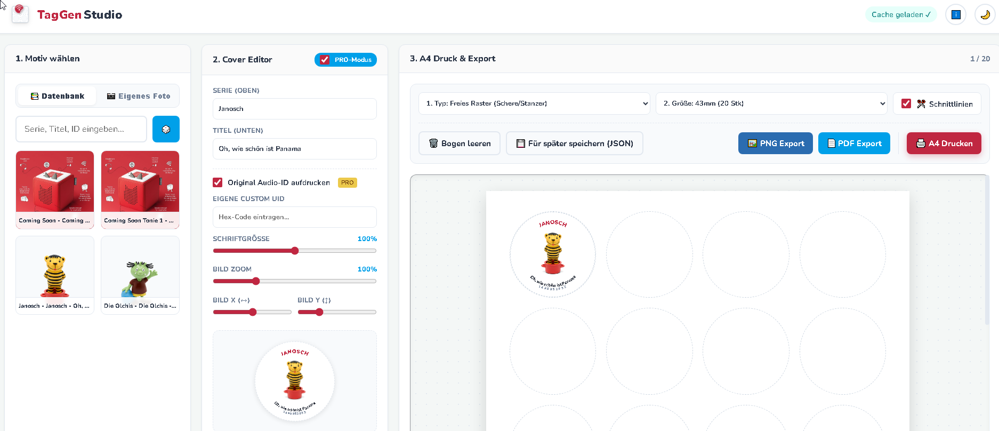

# 🎨 TagGen Studio

**Der Next-Generation Cover-Generator für Custom NFC-Tags & Magic Tags.**

TagGen Studio ist eine rasante, browserbasierte Single-Page-Application (SPA), mit der du im Handumdrehen perfekte, runde Aufkleber für deine selbstgemachten NFC-Tags erstellen, anordnen und ausdrucken kannst. Speziell entwickelt für die Maker- und Tonie-Community, 100% offline-fähig (PWA) und komplett ohne nervige Backend-Abhängigkeiten.

🔗 [**[Hier geht's zur Live-Version (Live Demo)](https://stevenious.github.io/Tonie-custom-Tags-Cover-Generator/)**](#) 

---

## ✨ Features

* **⚡️ Live-Datenbank:** Zieht sich die aktuellste Community-JSON (V2) automatisch aus dem GitHub-Repo und cacht sie ressourcenschonend im Browser, um Ladezeiten zu minimieren.
* **🎛️ Simpel- & Pro-Modus:**
  * *Simpel:* Motiv suchen, anklicken, auf den Bogen legen – ideal für den schnellen Druck.
  * *Pro:* Bildausschnitt präzise verschieben (X/Y), stufenloser Zoom, Schriftgrößen-Anpassung und eigene Custom-UIDs eintragen.
* **🔄 Mathematisch gekrümmter SVG-Text:** Titel und Seriennamen schmiegen sich perfekt an die runde Kante des Aufklebers an (inkl. intelligentem Filter für redundante Folgentitel).
* **📐 Intelligente Druck-Engine & Schnittlinien:**
  * **Freies Raster:** 25mm, 30mm, 40mm und 43mm (perfekt für Münzkapseln) mit optionalen, zuschaltbaren Schnittmarken.
  * **Avery Zweckform:** Exakt abgestimmte Margins für vorgestanzte DIN-A4 Bögen (z. B. 30mm & 40mm Etiketten).
* **🖱️ Drag & Drop Workspace:** Ziehe fertig generierte Sticker frei auf dem virtuellen Druckbogen umher – ideal, um angefangene Klebebögen wirtschaftlich weiterzuverwendet.
* **💾 Multi-Export:**
  * Direkter, maßstabsgetreuer Browser-Druck (inkl. Skalierungs-Hinweis).
  * Hochauflösender **300dpi PNG-Export**.
  * Vektorbasiertes **PDF**.
  * **JSON-Export** für gespeicherte Tags.
* **📱 PWA Ready:** Installiere TagGen Studio als native App auf deinem Smartphone oder Desktop. Einmal geladen, funktioniert das Tool komplett offline!
* **🌗 Ergonomisches Design:** Integrierter Light- und Dark-Mode mit originaler Tonie-Farbpalette.

---

## 🚀 Quick Start / Benutzung

Da TagGen Studio komplett im Client (deinem Browser) läuft, gibt es keinen komplizierten Installationsprozess.

### Option 1: Live nutzen
Klicke einfach auf den Link zur Live-Demo. Du kannst die Seite auf deinem Smartphone über das Browser-Menü auch direkt *"Zum Startbildschirm hinzufügen"* (PWA-Installation).

### Option 2: Lokal hosten / Forken
1. Lade dir die `index.html` aus diesem Repository herunter.
2. Mache einen Doppelklick darauf – die App öffnet sich sofort in deinem Browser.
3. Alternativ: Forke das Repository und aktiviere **GitHub Pages** in den Repo-Einstellungen, um deine eigene Instanz zu hosten.

---

## 📖 Anleitung: In 3 Schritten zum perfekten Bogen

1. **Motiv wählen:** Nutze die Live-Suche in der Community-Datenbank (Filter nach Serie, Titel oder ID) oder lade ein eigenes Foto hoch.
2. **Cover Editor:** Passe Serie und Titel an. Aktiviere den blauen **PRO-Modus**, um das Hintergrundbild zu skalieren, zu zentrieren oder eine Audio-ID aufzudrucken. Klicke auf *"+ Auf den Druckbogen legen"*.
3. **Druckbogen anpassen & Exportieren:** Wähle zwischen *Freiem Raster* (inkl. Schnittlinien) oder *Avery Zweckform*. Exportiere das Ergebnis als PDF, PNG oder drucke direkt aus dem Browser. 
   > 🖨️ **Wichtig beim Drucken:** Achte darauf, dass die Skalierung in den Druckereinstellungen auf exakt **100%** bzw. **"Tatsächliche Größe"** steht!

---

## 🛠️ Tech-Stack

* **HTML5 / CSS3 / Vanilla JavaScript:** Keine schweren Frameworks wie React oder Vue – eine einzige, pfeilschnelle und autarke Datei.
* **html2pdf.js & html2canvas:** Für hochauflösenden PDF- und 300dpi PNG-Export.
* **SVG Paths:** Für verlustfreie, kreisrunde Text-Krümmung.

---

## 🤝 Mitwirken (Contributing)

Feedback, Bug-Reports und Pull Requests sind jederzeit willkommen! 
Wenn du ein neues Druckformat hinzufügen möchtest, kannst du einfach die `formatConfigs` in der `index.html` erweitern.

*Haftungsausschluss: Dieses Tool ist ein inoffizielles Community-Projekt und steht in keinerlei Verbindung zur Boxine GmbH.*
